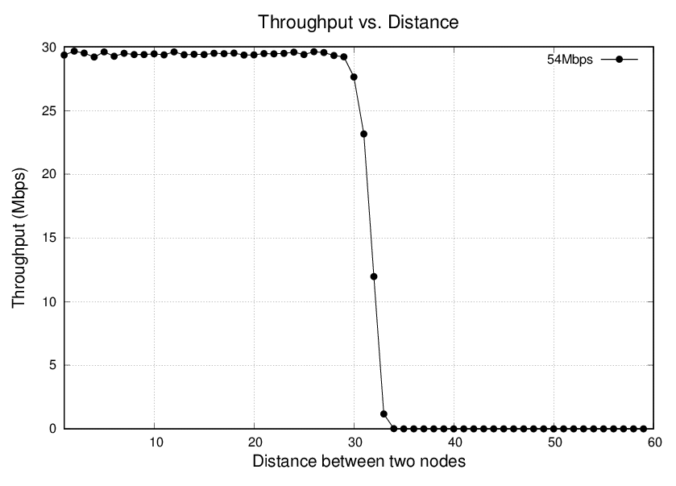

## Lab-02. 첫번째 시뮬레이션 스크립트

이 실습에서는, 무선랜 실험을 위한 시뮬레이션 스크립트를 이해한다.  
우리가 사용할 파일은 [script01.cc](script01.cc)이다.

아래에서는 라인별로 코드를 설명하였다.

---

```cpp
#include "ns3/core-module.h"
#include "ns3/mobility-module.h"
#include "ns3/wifi-module.h"
#include "ns3/internet-module.h"
#include "ns3/applications-module.h"
```

헤더파일을 include하는 부분이다. ns-3에서는 사용하는 함수에 대한 헤더파일을 각각 
포함시킬 수도 있지만, 지금의 경우와 같이 특정 디렉토리에 있는 헤더 전체를 묶어서
포함시킬 수 있다. 예를 들어, ```wifi-module.h```를 포함시키면,```wifi``` 디렉토리에
있는 헤더파일 전체가 포함된다. ```core-module```은 반드시 포함되어야 하고, ```mobility```,
```wifi```, ```internet```, ```applications```는 시뮬레이션 스크립트에서 사용되기
때문에 포함을 시켰다.

```cpp
using namespace ns3;
```

ns3 namespace를 사용하겠다고 선언하는 것이다. 이를 선언하지 않으면 많은 함수들에서 ```ns3::```를
앞에 붙여야 한다. 뒤에 나오는 ```std::string```과 같은 함수도 만약 ```std``` namespace를
선언해놓으면 ```std::```를 붙이지 않아도 되지만, 여기서는 ```ns3``` namespace를 사용하기 때문에
```std::string```과 같이 사용하였다.

```cpp
NS_LOG_COMPONENT_DEFINE("SimulationScript");
```

로깅(logging)을 위해서 이름을 선언해주는 부분이다. 이렇게 선언해놓으면 이 파일에서 ```NS_LOG_FUNCTION```등을 이용하여
로그메시지를 출력할 때 앞에 ```SimulationScript```라는 이름이 붙게 된다.

```cpp
CommandLine cmd;
cmd.Parse(argc, argv);
```

시뮬레이션을 실행시킬 때 주는 커맨드라인 인자를 정의하는 부분이다. 현재는 아무것도 정의하지 않은 상태이다.

```cpp
NodeContainer wifiNodes;
wifiNodes.Create(2);
```

```NodeContainer``` 클래스는 노드들을 한꺼번에 관리하기 위한 클래스이다. 이 클래스의 인스턴스를 생성하고,
2개의 노드를 만든다. 노드를 생성한 다음에는 무선채널, PHY, MAC, Network, Transport, Application 등
각 레이어에 해당하는 프로토콜을 선택하고 파라미터를 설정해 주어야 한다.

```cpp
YansWifiChannelHelper channel;
channel.AddPropagationLoss("ns3::LogDistancePropagationLossModel");
channel.SetPropagationDelay("ns3::ConstantSpeedPropagationDelayModel");
```

무선채널을 생성한다. 신호감쇄모델로는 실내환경을 가정할 때 주로 쓰이는 log-distance path loss 모델을 사용하고,
지연모델은 노드가 움직이지 않는 것을 가정한 constant speed 모델을 사용한다. 다른 모델을 사용하고 싶으면
이 부분을 변경해주면 된다. (예를 들어, log-distance 모델 대신 실외환경을 가정한 Friis 모델을 사용할 수 있다.)

```cpp
YansWifiPhyHelper phy = YansWifiPhyHelper::Default();
phy.SetChannel(channel.Create());
phy.Set("ShortGuardEnabled", BooleanValue(1));
phy.Set("TxPowerStart", DoubleValue(20.0));
phy.Set("TxPowerEnd", DoubleValue(20.0));
phy.Set("EnergyDetectionThreshold", DoubleValue(-96.0));
phy.Set("CcaMode1Threshold", DoubleValue(-99.0));
```

PHY 모델을 생성하고 무선채널과 연결시켜준다. 그리고 PHY의 파라미터들을 설정한다. ```ShortGuardEnabled```는 
short guard interval (400ns)를 사용할 것인지, long guard interval (800ns)를 사용할 것인지
결정하는 것이다. ```TxPowerStart```와 ```TxPowerEnd```는 노드가 사용할 수 있는 전송파워의 범위를
정해준다. 만약 자동으로 노드의 전송파워를 변경하는 기술을 사용할 경우, 노드는 이 범위 안에서 파워를 조절할 수 있게
된다. 단위는 dBm이다.

```EnergyDetectionThreshold```와 ```CcaMode1Threshold```는 노드가 신호를 수신하는 수신세기의
임계값에 해당하는 파라미터이다. 수신 신호의 세기가 ```EnergyDetectionThreshold``` 값보다 커야 노드가
패킷을 수신할 수 있고, 감지되는 신호의 세기가 ```CcaMode1Threshold``` 값보다 크면 노드가 현재 채널
상태를 busy로 판단한다. 일반적으로 ```EnergyDetectionThreshold```가 ```CcaMode1Threshold```보다
크다. 두 값의 단위는 dBm이다.

```cpp
WifiMacHelper mac;
mac.SetType("ns3::AdhocWifiMac");
```

MAC 모델을 생성하고 ad-hoc 모드로 설정해준다. Ad-hoc 모드의 경우 AP없이 모바일 노드끼리 직접 통신하는 형태를
말하며, 이 외에도 AP 모드(```APWifiMac```)와 station 모드(```StaWifiMac```) 가 있다.

```cpp
WifiHelper wifi;
wifi.SetStandard(WIFI_PHY_STANDARD_80211a);
std::string dataMode("OfdmRate54Mbps");
wifi.SetRemoteStationManager("ns3::ConstantRateWifiManager", "DataMode", StringValue(dataMode));
```

PHY와 MAC이 802.11a/b/g/n/ac 중 어떤 표준을 사용하고, 어떤 MCS 레벨로 통신을 할지 결정한다. 여기서는
802.11a를 사용하고, 54Mbps의 속도를 갖는 MCS 레벨을 사용하는 것으로 선언되었다. 데이터와 컨트롤 (RTS/CTS/ACK)
메시지에 대해 서로 다른 MCS레벨을 사용하기 위해서는, ```SetRemoteStationManager```에 ```ControlMode```
에 대한 값을 따로 선언해주면 된다.

```cpp
NetDeviceContainer devices = wifi.Install(phy, mac, wifiNodes);
```

지금까지 구성한 PHY와 MAC을 갖는 네트워크 디바이스를 생성한다. 

```cpp
MobilityHelper mobility;
Ptr<ListPositionAllocator> positionAlloc = CreateObject<ListPositionAllocator>();
positionAlloc->Add(Vector(0.0, 0.0, 0.0));
positionAlloc->Add(Vector(20.0, 0.0, 0.0));
mobility.SetPositionAllocator(positionAlloc);
mobility.SetMobilityModel("ns3::ConstantPositionMobilityModel");
mobility.Install(wifiNodes);
```

ns-3에서 mobility module은 노드의 위치와 움직임을 관장한다. 따라서 노드가 움직이지 않는 환경에서도 노드의
위치 설정을 위해 이 모듈을 사용해야 한다. 노드의 위치를 지정하기 위한 allocator는 여러 개의 클래스가 있는데,
이중에 ```ListPositionAllocator```는 노드의 위치를 직접 하나씩 지정해 줄 때 사용하는 것이다. 이 외에도
```GridPositionAllocator```나 ```RandomBoxPositionAllocator```등 여러 형태의 클래스가 
존재한다.

```ListPositionAllocator```를 사용하면, 노드의 위치를 ```Vector(20.0, 0.0, 0.0)```과 같이
지정해 주어야 한다. 여기에 들어가는 세 개의 숫자는 3-D 공간상의 X, Y, Z 좌표이고, 단위는 미터이다.

이 실험에서 노드는 움직이지 않으므로 mobility model은 ```ConstantPositionMobilityModel```로
설정해주었다.

```cpp
InternetStackHelper internet;
internet.Install(wifiNodes);
Ipv4AddressHelper ipv4;
ipv4.SetBase("192.168.1.0", "255.255.255.0");
Ipv4InterfaceContainer ip = ipv4.Assign(devices);
```

노드의 IP address를 설정해준다. 여러 개의 노드가 있을 경우 각각 설정해 줄 필요없이 이와 같이 하면 
IP 주소가 자동으로 할당이 된다.

```cpp
UdpServerHelper myServer(9);
ApplicationContainer serverApp = myServer.Install(wifiNodes.Get(0));
serverApp.Start(Seconds(60.0));
serverApp.Stop(Seconds(61.0));
```

노드의 transport layer를 설정하고 그 위에 전송할 트래픽을 구성하는 부분이다. 여기서는 0번 노드에
UDP 서버를 구성하고 60-61초 사이에 동작하도록 설정하였다. ```myServer(9)```의 9는 포트번호로
원하는대로 설정해 주면 된다.

```cpp
UdpClientHelper myClient(ip.GetAddress(0), 9);
myClient.SetAttribute("MaxPackets", UintegerValue(4294967295u));
myClient.SetAttribute("Interval", TimeValue(Seconds(0.0001)));
myClient.SetAttribute("PacketSize", UintegerValue(1472));
ApplicationContainer clientApp = myClient.Install(wifiNodes.Get(1));
clientApp.Start(Seconds(60.0));
clientApp.Stop(Seconds(61.0));
```

여기서는 1번 노드에 UDP 클라이언트를 설정하고 60-61초 사이에 동작하도록 한다. 먼저 첫번째 줄에
```myClient(ip.GetAddress(0), 9)```의 인자는 연결할 서버의 IP 주소와 포트번호이다.
그 다음 세 줄은 트래픽의 형태를 설정하는 것인데, ```MaxPackets```는 전송할 최대 패킷 수,
```Interval```은 패킷 전송 간격, ```PacketSize```는 한 패킷의 크기를 의미한다.
여기서의 크기는 UDP 헤더와 IP 헤더는 제외한 값이고 단위는 byte이다. ```Interval```의 
단위는 초이다.

```cpp
Simulator::Stop(Seconds(61.1));
Simulator::Run();
Simulator::Destroy();
```

이제 구성이 다 되었으니 시뮬레이션을 실행시킨다. 먼저 시뮬레이션이 종료하는 시간을 정해주고(```Stop```),
시뮬레이션을 실행한 다음(```Run```), 시뮬레이터를 제거한다(```Destroy```).

```cpp
uint32_t totalPacketsReceived = DynamicCast<UdpServer>(serverApp.Get(0))->GetReceived();
double throughput = totalPacketsReceived * 1472 * 8 / (1.0 * 1000000.0);
```

시뮬레이션의 목적은 성능을 측정하는 것이다. 여기서는 초당 전송량(throughput)을 측정하는데, 이를 위하여
UDP server가 받은 전체 패킷의 수를 읽어오고, 이와 전송 시간을 고려하여 초당 전송량을 계산한다.

```cpp
NS_LOG_UNCOND("throughput: " << throughput << "Mbps");
return 0;
```

계산한 전송량을 화면에 출력하고 main 함수를 마친다.

이 스크립트를 아래와 같이 실행한다.

```
./waf --run scratch/script01
```

실행하면 아래와 같은 결과를 얻을 수 있다.

```
throughput: 29.3576Mbps
```

---

### Task 1. 변수화와 인자 정의

이제부터 이 시뮬레이션 스크립트를 조금씩 변경하면서 ns-3 코드의 이해도를 높인다. 가장 먼저, 숫자로 표현된
파라미터값들을 쉽게 변경할 수 있도록 변수화하고, 이를 스크립트 실행 시 인자로 줄 수 있도록 변경한다.

먼저 아래와 같이 변수를 선언한다.

```cpp
uint16_t num_nodes  = 2;
double   tx_power   = 20.0;
double   ed_thresh  = -96.0;
double   cs_thresh  = -99.0;
double   interval   = 0.0001;
uint32_t packetSize = 1472;
double   distance   = 20.0;
double   begin_time = 60.0;
double   sim_time   = 1.0;
```

변수들의 의미는 직관적으로 알 수 있을 것이다. 트래픽의 시작 시간인 ```begin_time```과 함께 ```end_time```을 
변수화하는 대신 트래픽 전송 기간인 ```sim_time```을 정의하였다. 또한, ```distance```는 1번 노드의 위치인
```20.0``` 대신 사용하여 두 노드 간의 거리를 나타내는 변수로 사용한다.

이렇게 변수들을 선언한 후, **코드에서 숫자를 변수로 바꿔야 하는 부분을 전부 바꿔준다**.

다음으로는 사용자가 스크립트를 실행할 때 파라미터를 인자로 줄 수 있도록 한다. 이를 위하여 다음과 같이
사용자 인자를 정의해주면 된다.

```cpp
CommandLine cmd;
cmd.AddValue("distance", "distance between nodes", distance);
cmd.Parse(argc, argv);
```

위의 변수들을 모두 인자화 할 수 있지만, 여기서는 ```distance``` 하나만 하였다. ```AddValue```의
인자는 세 개인데, 첫 번째는 사용자가 기입하는 인자의 이름, 두 번째는 인자에 대한 설명, 세 번째는 연동되는
변수 이름이 된다.

이제 이 스크립트를 실행시켜본다. 수정한 스크립트의 이름은 script01-01.cc로 가정한다.  
인자를 주면서 실행하는 방법은 아래와 같다.

```
./waf --run "scratch/script01-01 --distance=20"
```

이렇게 실행하면 이전과 같이 29.3576Mbps의 전송량이 나온다. 하지만 distance를 40으로 바꾸면, 결과가 0Mbps로
나오는데, 이는 두 노드 사이의 거리가 너무 멀어서 서로의 패킷을 복원할 수 없기 때문이다. 

---

### Task 2. Batch 실험

노드 사이의 거리와 전송량간의 상관관계를 알고 싶다고 하자. 이를 위하여서는 두 노드 간의 거리를 바꿔가면서 실험을 여러 번 해야 한다.
실험을 할때마다 일일히 손으로 distance를 변경하고 실험을 돌리고 결과를 적어놓고 하는 것은 번거로운 일이므로, 한꺼번에 파라미터를
바꿔가면서 실험을 하는 batch 실험이 필요하다. Batch 실험을 하는 방법은 여러 가지가 있다. 실험코드를 하나의 함수로 만들어
main 함수에서 여러번 그 함수를 호출하도록 할 수도 있고, 외부에서 bash shell script 등을 이용하여 실험을 여러번 수행하도록
할 수도 있다. 이 외에도 여러 가지 방식이 있고, 이들은 모두 장단점이 있기 때문에 어떤 방식을 사용하는 것이 가장 좋다고 말할 수는 없다.
여기서는 간단하게 실험 코드를 함수로 만들어 여러번 호출하는 방식을 사용한다.

main 함수는 아래와 같이 구성한다.

```cpp
int main(int argc, char *argv[]) {

    CommandLine cmd;
    cmd.Parse(argc, argv);

    FILE *outfile = fopen("tput_dist.dat", "w");

    for(double d=1.0; d<60.0; d=d+1.0) {
        double tput = RunSimulation(d);
        NS_LOG_UNCOND(d << " " << tput);
        fprintf(outfile, " %4.1f  %8.3f\n", d, tput);
    }

    fclose(outfile);
}
```

**기존의 main 함수는 RunSimulation이라는 이름으로 바꿔주고, 인자로 distance를 받도록 한다.**

이제 스크립트(script01-02.cc)를 실행시키면, 결과로 tput_dist.dat이라는 파일이 나온다. 이 파일의 각 라인에는 노드 사이의 거리와 그에 따른 전송량이 기록되어있다.
[Gnuplot](http://www.gnuplot.info)을 이용하여 이 데이터를 그래프로 만들수가 있다. 먼저 Gnuplot용 스크립트를 아래와 같이 작성한다.
파일이름은 draw.scr로 가정한다.

```
set terminal postscript eps
set output "graph_tput_dist.eps"
set key top right
set title "Throughput vs. Distance" font "Helvetica, 20"
set xlabel "Distance between two nodes" font "Helvetica, 18"
set ylabel "Throughput (Mbps)" font "Helvetica, 18"
set xrange [1:60]
set yrange [0:30]
set grid
plot "tput_dist.dat" using 1:2 title "54Mbps" with linespoints pt 7 ps 1.2 lw 1.5
```

이렇게 작성한 후 아래와 같이 Gnuplot을 실행시킨다.

```
gnuplot draw.scr
```

이와 같이 실행시키면 결과로 graph_tput_dist.eps가 생성된다. eps파일은 [ghostview](http://pages.cs.wisc.edu/~ghost/)등을 이용하여 볼 수 있다.

<center></center>

---

### Task 3. MCS 레벨 변경

위의 실험에서는 ```dataMode``` 파라미터를 ```OfdmRate54Mbps```로 설정하여 사용하였다. 이는 54Mbps의 전송속도를 내는 MCS 레벨을 사용하겠다는
뜻이다. 802.11a에는 총 7개의 MCS 레벨이 정의되어있는데, 54Mbps는 가장 높은 MCS 7에 해당하는 것이다. 높은 MCS 레벨을 사용할 수록 수신기가 패킷을
복원하기 위해 필요한 SNR이 높아지며, 따라서 MCS 레벨에 따라 전송거리 (transmission range)도 달라지게 된다.

** RunSimulation 함수에 두번째 인자로 ```mcs```를 추가한다.** 이 값은 사용하고자 하는 MCS 레벨을 의미한다.

함수 내에서 ```mcs``` 값에 따라 ```dataMode```를 설정해주는 부분을 다음과 같이 만들어주면 된다.

```cpp
std::string dataMode;
if(mcs==0) dataMode = std::string("OfdmRate6Mbps");
if(mcs==1) dataMode = std::string("OfdmRate9Mbps");
if(mcs==2) dataMode = std::string("OfdmRate12Mbps");
if(mcs==3) dataMode = std::string("OfdmRate18Mbps");
if(mcs==4) dataMode = std::string("OfdmRate24Mbps");
if(mcs==5) dataMode = std::string("OfdmRate36Mbps");
if(mcs==6) dataMode = std::string("OfdmRate48Mbps");
if(mcs==7) dataMode = std::string("OfdmRate54Mbps");
```

main 함수에서 사용자가 MCS 레벨을 커맨드라인에 입력할 수 있도록 인자로 등록해준다.

```cpp
uint16_t mcs = 7;

CommandLine cmd;
cmd.AddValue("mcs", "MCS index", mcs);
cmd.Parse(argc, argv);
```

이렇게 변경한 스크립트 (script01-03.cc)를 실행하되, MCS레벨을 0-7로 바꿔가면서 결과가 어떻게 달라지는지 확인한다. 

---

### Do It Yourself: MCS레벨에 따른 전송량과 전송거리

지금까지 배운 것을 토대로 MCS레벨에 따른 전송량과 전송거리를 그래프로 그려본다. 위에서 그린 그래프와 X축, Y축은 같고,
라인은 MCS 0, 3, 5, 7의 네 라인이 표시되도록 한다. X축과 Y축의 범위 (xrange, yrange)나 범례(key)의 위치,
라인의 종류(lt), 굵기(lw), 점의 종류(pt), 크기(ps) 등은 그래프의 가독성이 높아질수 있도록 잘 조절해준다.

한 그래프 안에 여러 개의 라인을 그리는 Gnuplot 스크립트는 [이것](draw_multiline.scr)을 참고하면 된다.

---


