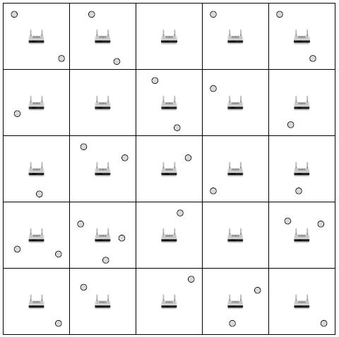

### Lab-04. 대규모 시뮬레이션

지난 실습에서는 두 개의 노드만으로 실습을 수행했었다. 본 실습에서는 두 개 이상의 노드가 공존하는
환경에서의 실험을 통해 시스템 성능을 확인한다.

---

#### 04.01. 시뮬레이션 환경 구성

<center></center>

위의 그림과 같은 환경에서 실험을 수행할 것이다. 오피스 빌딩 안에 여러 개의 방 또는 공간이 있고,
각 공간의 중앙에 무선랜 AP가 설치되어있다. 모바일 노드는 랜덤으로 위치가 결정된다.
각각의 모바일 노드는 자신이 통신을 할 AP를 정하는데, 이 실험에서는 가장 가까운 위치에 있는
AP로 정하게 된다. 트래픽은 일단 업로드 트래픽(모바일 노드에서 AP로 향하는 트래픽)만 있다고 가정한다.

이 실험을 수행하기 위한 시뮬레이션 스크립트가 script04.cc이다. 내용을 보면 지난 실습의 script03.cc와
많은 부분이 유사하고, 일부 내용이 바뀌었는데, 이 바뀐 부분을 중심으로 아래에 코드를 설명하였다.


```cpp
#include "ns3/core-module.h"
#include "ns3/mobility-module.h"
#include "ns3/wifi-module.h"
#include "ns3/internet-module.h"
#include "ns3/applications-module.h"
#include "ns3/random-variable-stream.h"

#define MAX_STAS 100

using namespace ns3;

NS_LOG_COMPONENT_DEFINE("SimulationScript");

Ptr<UniformRandomVariable> m_random;
uint32_t seed;

uint16_t num_rooms_rows;
uint16_t num_rooms_cols;
uint16_t num_stas;

double   begin_time;
double   sim_time;
uint32_t payload_size;
double   grid_length;

double   pre_begin_time;
double   pre_interval;
double   pre_duration;

uint16_t mybs[MAX_STAS];

NetDeviceContainer apDevices;
NetDeviceContainer staDevices;
```

시뮬레이션 스크립트의 맨 앞부분이다. 지금까지는 main 함수 내에 있었던 변수들을 전역변수로 선언하였는데, 이렇게 한 이유는 main 함수 외에서도 이 변수들을 접근하기 위함이다.
물론 이렇게 하지 않고 main 함수에 변수들을 선언한 다음, 함수를 호출할 때마다 인자로 넣어줄 수도 있다.

가장 먼저 설명할 내용은 변수 m_random과 seed이다. m_random은 랜덤넘버 추출을 위해서 필요한 변수인데 Ptr<UniformRandomVariable> 형의 변수로 선언해주면 된다.
랜덤넘버에 관해서는 다음의 세 가지만 알고 있으면 된다.

(1) 포인터로 선언되어 있으므로 사용하기 전에 인스턴스를 만들어 준다.

```cpp
m_random = CreateObject<UniformRandomVariable>();
```

(2) 랜덤 시드를 정해준다. 이 시드에 따라 랜덤넘버 추출의 순서가 달라지게 된다. 만약 시드가 같으면 항상 같은 시퀀스의 랜덤넘버가 나오게 된다.

```cpp
m_random->SetStream(seed);
```

(3) 이제부터는 랜덤넘버를 하나씩 추출하여 사용하면 된다. 랜덤넘버는 0과 1 사이의 실수값이다.

```cpp
double x = m_random->GetValue();
```

seed는 SetStream 함수에 인자로 넣어주기 위한 변수이다.

다음 세 줄에 선언되어 있는 num_rooms_cols, num_rooms_rows, num_stas는 AP와 모바일노드의 개수에 관한 것이다. AP의 개수는 num_rooms_cols*num_rooms_rows가 되고,
num_stas는 모바일 노드의 개수이다. 또한, 아래에 선언되어 있는 grid_length는 각 방의 한 면의 길이를 의미한다. 여기서 모든 방은 정사각형 모양이라고 가정하였다.

begin_time과 sim_time은 전 실습에서도 있었기 때문에 이해할 수 있겠지만, 여기에는 pre_begin_time, pre_interval, pre_duration이 추가가 되었다. 아래의 코드에서 보면
본격적으로 트래픽을 전송하면서 실험하기 전에 먼저 약간의 트래픽을 전송하는 부분이 있다는 것을 알 수 있다. 이 부분은 ARP activation을 위한 부분으로, ARP 실패로 인한 성능 저하를
방지하려고 만든 부분이다. 즉, 이 부분에서 ARP는 모두 activation이 되고, 뒷부분에 본격적으로 트래픽을 전송할 때는 ARP Request와 ARP Reply가 전송되지 않는다. 

여기서 한 가지 주의할 것은, pre_begin_time과 begin_time 사이의 차이가 너무 크면, 그 사이에 ARP table의 엔트리가 시간초과로 리셋될 수 있다는 것이다. ARP가 activation 된 후
얼마의 시간동안 유효한지는 src/internet/model/arp-cache.cc 에서 수정할 수 있다. GetTypeId 함수 안에 선언되어있는 여러 attribute 중 AliveTimeout과 DeadTimeout을 길게 잡아주면
시뮬레이션 기간 동안에 ARP table의 엔트리가 expire되지 않도록 만들 수 있다.

apDevices와 staDevices는 각각 AP와 모바일 노드에 관한 컨테이너인데, main 외의 함수에서 노드들을 접근할 수 있기 때문에 전역변수로 선언하였다. mybs에 대해서는 뒤에 설명한다.

```cpp
static void PrintProgress(void) {
  fprintf(stderr, ".");
  if(Simulator::Now() > Seconds(begin_time + sim_time - 0.1/2)) fprintf(stderr, "\n");
  Simulator::Schedule(Seconds(0.1), &PrintProgress);
}
```

시뮬레이션이 오래 걸릴 때 진행상황을 표시해주기 위한 함수이다. 뒤에 보면 이 함수를 begin_time에 호출하도록 스케쥴링하는데, 이 함수가 호출되고 나면
0.1초마다 다시 자신을 부르도록 스케쥴링하기 때문에 0.1초에 한번씩 화면에 점이 찍히게 된다.

```cpp
int main(int argc, char *argv[]) {

    m_random = CreateObject<UniformRandomVariable>();
    seed           = 1;

    num_rooms_rows = 2;
    num_rooms_cols = 2;
    uint16_t num_aps = num_rooms_rows*num_rooms_cols;
    num_stas       = 10;

    begin_time     = 1000.0;
    sim_time       = 1.0;
    payload_size   = 1472;
    grid_length    = 10;

    pre_begin_time = 100.0;
    pre_interval   = 1.0;
    pre_duration   = 0.01;

    // Process command line arguments
    CommandLine cmd;
    cmd.AddValue("seed", "Random Seed", seed);
    cmd.Parse(argc, argv);

    // Set random seed
    m_random->SetStream(seed);

    // Create nodes
    NodeContainer apNodes;
    apNodes.Create(num_rooms_rows*num_rooms_cols);
    NodeContainer staNodes;
    staNodes.Create(num_stas);
```

main 함수의 첫 부분이다. 일단은 전역으로 선언한 모든 변수의 초기값을 설정해주고, m_random에 대해서는 인스턴스를 만들어준다. 그 다음에는 사용자 입력 인자를 처리해
주는 부분인데 일단은 랜덤넘버 시드만 사용자가 정해줄 수 있도록 하였다. 사용자 입력 인자를 받고 나면 m_random 변수에 대한 시드를 지정해주고, 노드를 만든다. 이전
실습과의 차이는, 노드 컨테이너를 AP와 모바일 노드 (station)에 대해 따로 둔다는 것이다.

```cpp
    // Create and configure wireless channel
    YansWifiChannelHelper channel;
    channel.AddPropagationLoss("ns3::LogDistancePropagationLossModel");
    channel.SetPropagationDelay("ns3::ConstantSpeedPropagationDelayModel");

    // Create and configure PHY layer
    YansWifiPhyHelper phy = YansWifiPhyHelper::Default();
    phy.SetChannel(channel.Create());
    phy.Set("ShortGuardEnabled", BooleanValue(1));
    phy.Set("TxPowerStart", DoubleValue(20.0));
    phy.Set("TxPowerEnd", DoubleValue(20.0));
    phy.Set("EnergyDetectionThreshold", DoubleValue(-96.0));
    phy.Set("CcaMode1Threshold", DoubleValue(-99.0));

    // Create and configure MAC layer
    WifiMacHelper mac;
    mac.SetType("ns3::AdhocWifiMac");

    // Select which WLAN standard to use
    WifiHelper wifi;
    wifi.SetStandard(WIFI_PHY_STANDARD_80211a);
    std::string dataMode("OfdmRate54Mbps");
    wifi.SetRemoteStationManager("ns3::ConstantRateWifiManager", "DataMode", StringValue(dataMode));

    // Create network device and install PHY and MAC
    apDevices = wifi.Install(phy, mac, apNodes);
    staDevices = wifi.Install(phy, mac, staNodes);
```

이 부분은 이전 실습과 동일하다. 유일한 차이는 apDevices, staDevices와 같이 디바이스 컨테이너도 AP와 모바일 노드에 대해 따로 둔다는 것이다. 
이 둘에 대한 PHY, MAC 설정은 동일하다.

```cpp
    // Set node positions and mobility pattern
    MobilityHelper mobility;
    Ptr<ListPositionAllocator> apPositionAlloc = CreateObject<ListPositionAllocator>();
    for(uint16_t i=0; i<num_rooms_rows*num_rooms_cols; i++) {
        double x = double(i%num_rooms_rows*grid_length+grid_length/2);
        double y = double(i/num_rooms_rows*grid_length+grid_length/2);
        apPositionAlloc->Add(Vector(x, y, 0.0));
        NS_LOG_UNCOND("ap position: " << x << " " << y);
    }
    mobility.SetPositionAllocator(apPositionAlloc);
    mobility.SetMobilityModel("ns3::ConstantPositionMobilityModel");
    mobility.Install(apNodes);
```

AP 노드들에 대한 위치를 지정한다. 위의 그림에서도 보듯이 AP의 위치는 그리드(Grid) 형태이다. 그리드 형태로 노드를 배치할 때는
ListPositionAllocator대신 GridPositionAllocator를 사용하는 방법도 있다. 하지만 여기에서는 ListPositionAllocator를 쓰고,
각 AP에 대한 위치를 일일히 지정해주는 방식을 택하였다. 

```cpp
    Ptr<ListPositionAllocator> staPositionAlloc = CreateObject<ListPositionAllocator>();
    for(uint16_t i=0; i<num_stas; i++) {
        double x = m_random->GetValue()*num_rooms_cols*grid_length;
        double y = m_random->GetValue()*num_rooms_rows*grid_length;
        staPositionAlloc->Add(Vector(x, y, 0.0));
        NS_LOG_UNCOND("sta position: " << x << " " << y);
    }
    mobility.SetPositionAllocator(staPositionAlloc);
    mobility.SetMobilityModel("ns3::ConstantPositionMobilityModel");
    mobility.Install(staNodes);
```

모바일 노드의 위치를 지정한다. 모바일 노드는 시뮬레이션 환경 내에 랜덤으로 배치하게 되는데, 이 때 m_random을 사용한다.
완전히 랜덤으로 배치하기 때문에 어떤 방에는 모바일 노드가 여러개 있고, 어떤 방에는 하나도 없을 수도 있다.


```cpp
    // Select default AP for each STA
    double max_dist;
    int16_t nearest_ap;
    double dist;
    for(uint16_t i=0; i<num_stas; i++) {
        nearest_ap = -1;
        Vector sta = staPositionAlloc->GetNext();
        for(uint16_t j=0; j<num_rooms_cols*num_rooms_rows; j++) {
           Vector ap = apPositionAlloc->GetNext();
           dist = (sta.x-ap.x)*(sta.x-ap.x) + (sta.y-ap.y)*(sta.y-ap.y);
           if(nearest_ap == -1 || dist < max_dist) {
               nearest_ap = j;
               max_dist = dist;
           }
        }
        mybs[i] = nearest_ap;
    }
```

여기에서는 각각의 모바일 노드가 접속할 AP를 선택한다. 지금 이 시뮬레이션 스크립트에서 보면 모든 노드를 AdhocWifiMac 형태로 지정해
놓은 것을 알 수 있다. 원래 AP와 모바일 노드가 있는 실험을 할 때는 ApWifiMac과 StaWifiMac을 사용하는 것이 맞다. 그렇게 하면
AP들은 주기적으로 비콘을 쏘고, station들은 비콘이나 프로브(probe)를 통해서 AP와 연결(association)을 이룬다. 하지만 여기에서는
비콘이나 프로브 과정을 생략하기 위하여 AdhocWifiMac을 쓰고, 대신에 위의 코드 블럭을 이용하여 어떤 모바일 노드가 어떤 AP와 통신할지를
정한다. 여기에 mybs 라는 배열이 나오는데, mybs[j]는 j번째 모바일 노드가 접속할 AP의 번호를 의미한다.

```cpp
    // Create and configure NETWORK layer (IP)
    InternetStackHelper internet;
    internet.Install(apNodes);
    internet.Install(staNodes);
    Ipv4AddressHelper ipv4;
    ipv4.SetBase("192.168.1.0", "255.255.255.0");
    Ipv4InterfaceContainer ip_ap = ipv4.Assign(apDevices);
    Ipv4InterfaceContainer ip_sta = ipv4.Assign(staDevices);
```

IP 주소를 배정하는 부분으로, 여기도 AP와 모바일 노드에 대해 따로 배정을 해주게 되어있다. AP에 먼저 배정이 다 되고, 그 다음 주소부터 STA에
배정이 된다.

```cpp
    // Traffic for ARP activation
    for(uint16_t i=0; i<num_aps; i++) {
        UdpServerHelper myServerPre(19);
        ApplicationContainer serverAppPre = myServerPre.Install(apNodes.Get(i));
        serverAppPre.Start(Seconds(pre_begin_time));
        serverAppPre.Stop(Seconds(pre_begin_time+pre_interval*num_stas+pre_duration));
    }
    for(uint16_t j=0; j<num_stas; j++) {
        UdpClientHelper myClientPre(ip_ap.GetAddress(mybs[j]), 19);
        myClientPre.SetAttribute("MaxPackets", UintegerValue(4294967295u));
        myClientPre.SetAttribute("Interval", TimeValue(Time("0.001")));
        myClientPre.SetAttribute("PacketSize", UintegerValue(payload_size));
        ApplicationContainer clientAppPre = myClientPre.Install(staNodes.Get(j));
        clientAppPre.Start(Seconds(pre_begin_time+pre_interval*j));
        clientAppPre.Stop(Seconds(pre_begin_time+pre_interval*j+pre_duration));
    }
```

트래픽을 설정하는 부분이다. 첫째로, 여러 개의 트래픽 플로우가 있으면 위와 같이 for loop를 이용해서 설정해 줄 수 있다. 둘째로, 
클라이언트가 서버의 주소를 지정할 때 mybs[j]와 같이 쓰는데, mybs는 위에서 말한대로 j번 모바일 노드가 접속할 AP의 번호이다.
마지막으로 interval이 0.001인데, 여기서는 실제 전송량에 관심이 있는 것이 아니라 ARP activation만을 해주기 위해서 임시로
트래픽을 보내는 것이므로 interval을 매우 짧게 해줄 필요가 없다.

```cpp
    // Real traffic
    std::vector<ApplicationContainer> servers;

    for(uint16_t i=0; i<num_aps; i++) {
        UdpServerHelper myServer(9);
        ApplicationContainer serverApp = myServer.Install(apNodes.Get(i));
        serverApp.Start(Seconds(begin_time));
        serverApp.Stop(Seconds(begin_time+sim_time));
        servers.push_back(serverApp);
    }
    for(uint16_t j=0; j<num_stas; j++) {
        UdpClientHelper myClient(ip_ap.GetAddress(mybs[j]), 9);
        myClient.SetAttribute("MaxPackets", UintegerValue(4294967295u));
        myClient.SetAttribute("Interval", TimeValue(Seconds(0.0002)));
        myClient.SetAttribute("PacketSize", UintegerValue(payload_size));
        ApplicationContainer clientApp = myClient.Install(staNodes.Get(j));
        clientApp.Start(Seconds(begin_time+0.001*(j)));
        clientApp.Stop(Seconds(begin_time+sim_time));
    }
```

여기서는 진짜 전송량을 측정할 트래픽 패턴을 설정한다. 위의 임시 트래픽과 달라진 점은 servers라는 벡터 변수를 사용한다는 것인데,
나중에 전송량 측정을 위해 serverApp 들을 모두 저장해 놓아야 하기 때문이다. ```servers.push_back(serverApp);```와 같이
서버를 servers 벡터에 차례로 저장해준다.

```cpp
    // Predefined schedules
    Simulator::Schedule(Seconds(begin_time), &PrintProgress);

    // Run simulation
    Simulator::Stop(Seconds(begin_time+sim_time+0.1));
    Simulator::Run();
    Simulator::Destroy();

    // Throughput calculation ----------------------------------------------------
    double total_throughput = 0.0;
    for(uint16_t i=0; i<num_aps; i++) {
        uint32_t totalPacketsThrough = DynamicCast<UdpServer>(servers[i].Get(0))->GetReceived();
        double throughput = totalPacketsThrough * payload_size * 8 / (sim_time * 1000000.0); //Mbps
        total_throughput += throughput;
        NS_LOG_UNCOND("throughput: " << throughput << "Mbps");
    }

    NS_LOG_UNCOND("total throughput: " << total_throughput << "Mbps");
    return 0;
}
```

마지막으로 시뮬레이션을 실행시키는 부분이다. Run을 부르기 이전에, 시뮬레이션 중간에 실행을 해야 할 함수가 있다면 Schedule 함수를 이용하여 스케쥴링해준다.
전송량을 측정할 때는 servers 벡터로부터 각각의 서버를 읽어서 전송량을 더해주면 총 전송량을 계산할 수 있다.

시뮬레이션 스크립트의 내용을 이해했으면 이제 실행을 해서 결과를 확인해본다.

```
./waf --run "scratch/script04 --seed=100"

ap position: 5 5
ap position: 15 5
ap position: 5 15
ap position: 15 15
sta position: 16.4306 12.0165
sta position: 16.2681 19.9679
sta position: 0.206688 8.5618
sta position: 2.49441 13.4495
sta position: 0.279089 16.062
sta position: 1.1076 15.9267
sta position: 14.5161 4.76351
sta position: 3.74349 18.8598
sta position: 18.3152 5.74766
sta position: 7.54158 5.01399
...........
throughput: 5.19322Mbps
throughput: 10.3864Mbps
throughput: 9.10285Mbps
throughput: 3.94496Mbps
total throughput: 28.6275Mbps
```

이와 같이 결과가 나온다. ap position과 sta position은 AP와 모바일 노드의 위치인데 디버깅을 위하여 출력하였다.

---

### Task 1. 시뮬레이션 환경에 관한 파라미터 변경

위에서 실험한 시뮬레이션 환경은 방이 2x2 형태로 네 개가 있고, 각 방의 사이즈는 10mx10m인 환경으로, 전체 사이즈가
20mx20m이다. 전송량이 28-30Mbps가 나오는 것에서 짐작하겠지만, 이렇게 작은 사이즈의 환경에서는 어디에서든지 한
노드가 전송하면 다른 노드는 간섭때문에 전송할 수가 없다.

여기서는 방의 개수나 사이즈를 변경하여 전체 전송량에 어떤 영향을 미치는지를 살펴보도록 한다. 방의 사이즈를 결정할 때 주의해야 할 것은,
그 방 안에 배치가 되는 모바일 노드는 그 방의 중심에 있는 AP와 접속을 할텐데, 방의 사이즈가 너무 크면 방의 구석에서 중심까지의 거리가
너무 멀어져서 통신이 안되는 경우가 발생할 수 있다는 것이다.

모바일 노드의 개수도 변경하면서 실험 결과가 어떻게 달라지는지 확인해보고, 왜 그러한 실험 결과가 나오는지 생각해본다.

---

### Task 2. Minimum CW 사이즈 변화

지난 실습에서는 노드가 두 개만 있을 때, minimum CW를 변화시키면서 결과에 어떤 영향을 미치는지 확인해보았다. 이번에는 노드가 많은 
환경에서 minimum CW를 변화시키면서 결과에 어떤 영향을 미치는지 확인해보도록 한다.

---

### Task 3. 다운로드/업로드

지금 현재는 모든 트래픽이 모바일 노드에서 AP로 향하는 업로드 트래픽이다. 이 코드를 변경하여 다운로드와 업로드가 공존하는 형태로 변경시켜본다.
구체적으로는 각각의 모바일 노드에 대하여 트래픽을 설정할 때, 랜덤넘버를 통하여 다운로드 트래픽으로 할지 업로드 트래픽으로 할지를 결정한다.

---

### Task 4. Fairness

지금 현재는 성능 지표로 총 전송량(total throughput)만 사용하고 있다. 그런데 네트워크에서 총 전송량과 함께 중요한 것이 공평도 (fairness)이다.
Fairness를 계산하는 방법에는 여러가지가 있는데, 주로 쓰이는 것이 Jain's fairness index이다. 계산하는 방법은 아래와 같다.

**전체전송량^2 / (플로우의 개수 * (각 플로우의 전송량^2의 합))**

이렇게 계산하면 0과 1사이의 값이 나오는데, 1 쪽에 가까울 수록 공평한 것이다. 모든 플로우의 전송량이 같다면 fairness index은 1이 된다.
만약 한 플로우만 전송량이 있고 나머지는 모두 0인 경우, fairness index은 1/플로우 수 가 된다. 이것이 가장 불공평한 상태이다.

---

### Do It Yourself. 아이디어 도출

시뮬레이션 환경의 사이즈를 크게 하면서 전체 시스템 성능을 확인한다. 그리고, 같은 환경에서 어떻게 하면 전체 전송량이나 fairness를 향상시킬수 있을지
생각해보고 아이디어를 도출해본다.

