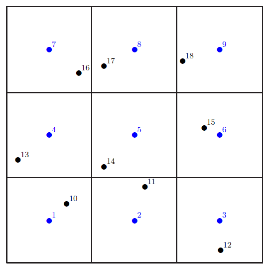

### Lab-05. 아이디어 도출

이번 실습에서는 특정 실험환경을 예로 들어 어떻게 하면 전송량과 공평도를 높일 수 있을지 고민해본다.

---

#### 05.01. 시뮬레이션 환경 구성

이번 실습에 사용할 시뮬레이션 스크립트는 script05.cc이다. 대부분의 내용은 지난 실습에서 다뤘던
것과 유사하고, 여기에 실험 수행과 결과 분석을 쉽게 하기 위한 기능이 추가되었다. 추가된 내용들은
다음과 같다.

(1) Topology를 tex 파일로 저장

ExportTopologyToLatex라는 함수가 추가되었다. 이 함수를 호출하면, 현재의 AP와 station의
위치를 tex 파일 포맷으로 출력해준다. 이 파일은 latex를 이용하여 PDF로 바꾸어 확인할 수 있는데,
PDF로 바꾸는 부분까지를 한꺼번에 실행하기 위해서는 다음의 패키지들이 설치되어있어야 한다.

- texlive-full
- ghostscript

이 기능을 사용할 경우 아래와 같은 tex 파일이 생성된다.

```
\documentclass{article}
\usepackage{epsfig}
\usepackage{color}
\usepackage{epic}
\usepackage{nopageno}
\definecolor{black}{rgb}{0,0,0}
\definecolor{red}{rgb}{1,0,0}
\definecolor{gray}{rgb}{0.5,0.5,0.5}
\definecolor{darkgray}{rgb}{0.25,0.25,0.25}
\definecolor{green}{rgb}{0,1,0}
\definecolor{blue}{rgb}{0,0,1}
\begin{document}
\setlength{\unitlength}{0.2mm}
\begin{picture}(500,500)
\thicklines
\put(0,0){\line(1,0){500}}
\put(500,0){\line(0,1){500}}
\put(500,500){\line(-1,0){500}}
\put(0,500){\line(0,-1){500}}
\put(166,0){\line(0,1){500}}
\put(332,0){\line(0,1){500}}
\put(0,166){\line(1,0){500}}
\put(0,332){\line(1,0){500}}
\thinlines\color{blue}\put( 83, 83){\circle*{10}}
\thicklines\color{blue}\put( 88, 88){\small 1}
\thinlines\color{blue}\put(250, 83){\circle*{10}}
\thicklines\color{blue}\put(255, 88){\small 2}
\thinlines\color{blue}\put(416, 83){\circle*{10}}
\thicklines\color{blue}\put(421, 88){\small 3}
\thinlines\color{blue}\put( 83,250){\circle*{10}}
\thicklines\color{blue}\put( 88,255){\small 4}
\thinlines\color{blue}\put(250,250){\circle*{10}}
\thicklines\color{blue}\put(255,255){\small 5}
\thinlines\color{blue}\put(416,250){\circle*{10}}
\thicklines\color{blue}\put(421,255){\small 6}
\thinlines\color{blue}\put( 83,416){\circle*{10}}
\thicklines\color{blue}\put( 88,421){\small 7}
\thinlines\color{blue}\put(250,416){\circle*{10}}
\thicklines\color{blue}\put(255,421){\small 8}
\thinlines\color{blue}\put(416,416){\circle*{10}}
\thicklines\color{blue}\put(421,421){\small 9}
\thinlines\color{black}\put(117,116){\circle*{10}}
\thicklines\color{black}\put(122,121){\small 10}
\thinlines\color{black}\put(270,149){\circle*{10}}
\thicklines\color{black}\put(275,154){\small 11}
\thinlines\color{black}\put(418, 25){\circle*{10}}
\thicklines\color{black}\put(423, 30){\small 12}
\thinlines\color{black}\put( 22,201){\circle*{10}}
\thicklines\color{black}\put( 27,206){\small 13}
\thinlines\color{black}\put(190,188){\circle*{10}}
\thicklines\color{black}\put(195,193){\small 14}
\thinlines\color{black}\put(386,264){\circle*{10}}
\thicklines\color{black}\put(391,269){\small 15}
\thinlines\color{black}\put(141,371){\circle*{10}}
\thicklines\color{black}\put(146,376){\small 16}
\thinlines\color{black}\put(190,384){\circle*{10}}
\thicklines\color{black}\put(195,389){\small 17}
\thinlines\color{black}\put(344,394){\circle*{10}}
\thicklines\color{black}\put(349,399){\small 18}
\end{picture}
\end{document}
```

그리고 이것을 PDF로 바꾸면 다음과 같은 그림을 얻을 수 있다.

<center></center>

그림에서 파란색은 AP이고 검은색은 station이다. 노드 옆에 붙어있는 번호는 노드의 IP 주소 맨
뒷부분이라고 보면 된다.

(2) 노드 별 전송량 출력

지난 실습까지는 UDP 서버별 전송량과 전체 전송량을 출력하였는데, fairness를 계산하기 위해서는
각 노드별로 얼마의 데이터를 전송했는지를 확인해야 한다. 이를 위하여 ns-3에서 제공하는 flow monitor
를 활용하여 노드별 전송량을 측정한다. 시뮬레이션 스크립트에서 이를 수행하는 코드 부분은 다음과 같다.

```cpp
    // Install flow monitor
    FlowMonitorHelper flowmon;
    Ptr<FlowMonitor> monitor = flowmon.InstallAll();
```

먼저 ```Simulation::Run```을 호출하기 전에, 위와 같이 flow monitor를 install 해 주어야 한다.
그리고 시뮬레이션을 수행한 후에, flow monitor에 저장된 stat 값들을 읽어온다.

```cpp
    Ptr<Ipv4FlowClassifier> classifier = DynamicCast<Ipv4FlowClassifier>(flowmon.GetClassifier());
    std::map<FlowId, FlowMonitor::FlowStats> stats = monitor->GetFlowStats();
    fprintf(stderr, "-------------------------------------------------------------------------\n");
    fprintf(stderr, "| ID |   src addr      |   dst addr      |    tx    |    rx    |  tput  |\n");
    fprintf(stderr, "-------------------------------------------------------------------------\n");
    int c = 0;
    for(std::map<FlowId, FlowMonitor::FlowStats>::const_iterator i=stats.begin(); i!=stats.end(); ++i) {
        Ipv4FlowClassifier::FiveTuple t = classifier->FindFlow(i->first);
        if(i->second.txPackets < 100) continue;
        c++;
        std::ostringstream oss;
        oss << t.sourceAddress;
        std::string sstr = oss.str();
        oss.str(std::string());
        oss << t.destinationAddress;
        std::string dstr = oss.str();
        double tput = i->second.rxBytes * 8.0 / sim_time / 1024.0 / 1024.0;

        total_rx_packets += i->second.rxPackets;
        total_rx_packets_sq += i->second.rxPackets * i->second.rxPackets;

        fprintf(stderr, "| %2d | %-15s | %-15s | %8lu | %8lu | %6.2f |\n", c, sstr.c_str(), dstr.c_str(), i->second.txBytes, i->second.rxBytes, tput);
    }
    fprintf(stderr, "-------------------------------------------------------------------------\n");
```

Flow monitor에는 각각의 트래픽 플로우에 대하여 source IP address, destination IP address, tx bytes, rx bytes, tx packets, rx packets 등의
통계값이 저장된다. 이 부분을 이용하여 전송량을 측정할 수 있다. 이 코드에서

```cpp
if(i->second.txPackets < 100) continue;
```

부분을 넣은 이유는, ARP activation을 위해 생성한 트래픽을 통계에서 제외시키기 위함이다.
이 코드가 수행되면 시뮬레이션의 결과로 다음과 같은 표가 나온다.

```
-------------------------------------------------------------------------
| ID |   src addr      |   dst addr      |    tx    |    rx    |  tput  |
-------------------------------------------------------------------------
|  1 | 192.168.1.10    | 192.168.1.1     |  7500000 |   895500 |   6.83 |
|  2 | 192.168.1.11    | 192.168.1.2     |  7494000 |   232500 |   1.77 |
|  3 | 192.168.1.12    | 192.168.1.3     |  7486500 |   483000 |   3.68 |
|  4 | 192.168.1.13    | 192.168.1.4     |  7477500 |   237000 |   1.81 |
|  5 | 192.168.1.14    | 192.168.1.5     |  7470000 |   313500 |   2.39 |
|  6 | 192.168.1.15    | 192.168.1.6     |  7464000 |   931500 |   7.11 |
|  7 | 192.168.1.16    | 192.168.1.7     |  7456500 |   414000 |   3.16 |
|  8 | 192.168.1.17    | 192.168.1.8     |  7449000 |   403500 |   3.08 |
|  9 | 192.168.1.18    | 192.168.1.9     |  7440000 |   394500 |   3.01 |
-------------------------------------------------------------------------
```

(3) fairness 측정한다

네트워크 상의 유저들이 공평하게 서비스를 받는지 측정하기 위하여 Jain's fairness index를 계산한다.
계산하는 방법은 [여기](https://en.wikipedia.org/wiki/Fairness_measure)를 참조하면 된다.
스크립트 상에서 fairness를 계산하고 출력하는 부분은 다음과 같다.

```cpp
    uint32_t total_rx_packets = 0;
    uint32_t total_rx_packets_sq = 0;
```

먼저 변수를 준비하고, flow monitor로부터 통계값을 읽을 때 이 변수들에 값을 더해준다.

```cpp
    Ptr<Ipv4FlowClassifier> classifier = DynamicCast<Ipv4FlowClassifier>(flowmon.GetClassifier());
    std::map<FlowId, FlowMonitor::FlowStats> stats = monitor->GetFlowStats();
    for(std::map<FlowId, FlowMonitor::FlowStats>::const_iterator i=stats.begin(); i!=stats.end(); ++i) {
        Ipv4FlowClassifier::FiveTuple t = classifier->FindFlow(i->first);
        total_rx_packets += i->second.rxPackets;
        total_rx_packets_sq += i->second.rxPackets * i->second.rxPackets;
    }
```

마지막으로, fairness index를 계산하여 출력한다.

```cpp
    // Fairness calculation ------------------------------------------------------
    double fairness = pow((double)total_rx_packets, 2) / (num_stas * (double)total_rx_packets_sq);
    NS_LOG_UNCOND("Jain's fairness index: " << fairness);
```

Jain's fairness index는 0과 1사이의 값이며, 1에 가까울 수록 공평한 것이다. 모든 노드가 같은 전송량을 가질 경우 fairness index가 1이 된다.


(4) Station의 위치를 방별로 고르게 분배

지난 실습에서, AP는 각 방의 중앙에 위치하며 station은 전체 시뮬레이션 구역에 랜덤하게 뿌려지는 방식으로 하였다. 하지만 이렇게 하게 되면 한 방에 많은
노드가 몰리고 다른 방에는 비어있는 경우가 발생할 수 있고, 이것이 시뮬레이션 결과에 큰 영향을 미친다. 그래서 이번 스크립트에서는, 노드들이 1번방부터 차례로
하나씩 들어가도록 변경하였으며, 방 안에서는 랜덤한 위치를 갖도록 하였다. 코드는 아래와 같다.

```cpp
    Ptr<ListPositionAllocator> staPositionAlloc = CreateObject<ListPositionAllocator>();
    for(uint16_t i=0; i<num_stas; i++) {
        uint16_t room = i % num_aps;
        double x = m_random->GetValue()*grid_length+(room%num_rooms_cols)*grid_length;
        double y = m_random->GetValue()*grid_length+(room/num_rooms_cols)*grid_length;
        staPositionAlloc->Add(Vector(x, y, 0.0));
        //NS_LOG_UNCOND("sta position: " << x << " " << y);
    }
    mobility.SetPositionAllocator(staPositionAlloc);
    mobility.SetMobilityModel("ns3::ConstantPositionMobilityModel");
    mobility.Install(staNodes);
```

---


#### 05.02. 파라미터 변경 방법

다음과 같이 실행해본다.

```
./waf --run "scratch/script05 --latex=1"
```

그러면 topology.pdf가 생성되고, 화면에 결과는 다음과 같이 출력될 것이다.

```
Starting Simulation...
...........
-------------------------------------------------------------------------
| ID |   src addr      |   dst addr      |    tx    |    rx    |  tput  |
-------------------------------------------------------------------------
|  1 | 192.168.1.10    | 192.168.1.1     |  7500000 |   895500 |   6.83 |
|  2 | 192.168.1.11    | 192.168.1.2     |  7494000 |   232500 |   1.77 |
|  3 | 192.168.1.12    | 192.168.1.3     |  7486500 |   483000 |   3.68 |
|  4 | 192.168.1.13    | 192.168.1.4     |  7477500 |   237000 |   1.81 |
|  5 | 192.168.1.14    | 192.168.1.5     |  7470000 |   313500 |   2.39 |
|  6 | 192.168.1.15    | 192.168.1.6     |  7464000 |   931500 |   7.11 |
|  7 | 192.168.1.16    | 192.168.1.7     |  7456500 |   414000 |   3.16 |
|  8 | 192.168.1.17    | 192.168.1.8     |  7449000 |   403500 |   3.08 |
|  9 | 192.168.1.18    | 192.168.1.9     |  7440000 |   394500 |   3.01 |
-------------------------------------------------------------------------
total throughput: 30.7942Mbps
Jain's fairness index: 0.79163
```

총 전송량이 약 30Mbps이고, 공평도 약 0.8인 것을 알 수 있다. 이제 고민해볼 것은, 
이 동일한 시뮬레이션 환경에서, 총 전송량이나 공평도를 높일 수 있는가이다. 총 전송량 30Mbps는
두 노드만 있는 실험에서의 전송량과 유사한데, 이것이 의미하는 것은 거의 한번에 한 노드밖에 전송하지 못했다는
것이다. 만약 여러 개의 노드가 동시에 성공적을 전송할 수 있다면, 전송량은 높아질 것이다.

전송량이나 공평도를 높이기 위한 방법은 파라미터를 조절하는 것부터 매체접근제어 방식 자체를 바꾸는 것까지
다양하게 있을 수 있다. 여기서는 조절할 수 있는 파라미터와 파라미터를 변경하는 방법에 대해 알아본다.

(1) Tx Power

시뮬레이션 스크립트에서 노드의 전송파워에 대한 부분 PHY를 설정할 때 나온다.

```cpp
    phy.Set("TxPowerStart", DoubleValue(20.0));
    phy.Set("TxPowerEnd", DoubleValue(20.0));
```

TxPowerStart와 TxPowerEnd가 있는데, 이 값을 다르게 해주는 경우는 automatic power control을 사용하기 위함이다.
이 두 값을 같게 설정해주면 그것이 노드의 전송 파워가 된다. 노드의 전송파워를 줄이면, 전송을 했을 때 수신자에서의 신호 세기가 줄어든다.
하지만 이와 함께 다른 노드에 미치는 간섭도 줄어들게 된다. 만약 노드와 수신자 간의 거리가 매우 가까워서 전송파워를 줄여도 수신자에서의
SNR에 문제가 없다면, 전송파워를 줄임으로써 간섭을 줄이는 것이 전체 시스템 성능에 도움이 될 수 있다.

위의 코드를 이용하면 모든 노드에 대해 한꺼번에 값을 설정해 주는 것이기 때문에, 노드별로 전송파워를 다르게 설정할 수가 없다.
노드별로 다르게 설정하기 위해서는 다음과 같이 하면 된다.

먼저 해당 변수가 어디 소속인지를 확인한다. 일단 phy.Set과 같이 되어 있으므로 PHY와 관련된 컴포넌트임을 알 수 있다.
src/wifi/model 디렉토리에 있는 wifi-phy.h를 보면 다음과 같이 변수와 접근함수들이 정의되어있다.

```cpp
  /**
   * Sets the minimum available transmission power level (dBm).
   *
   * \param start the minimum transmission power level (dBm)
   */
  void SetTxPowerStart (double start);
  /**
   * Return the minimum available transmission power level (dBm).
   *
   * \return the minimum available transmission power level (dBm)
   */
  double GetTxPowerStart (void) const;
  /**
   * Sets the maximum available transmission power level (dBm).
   *
   * \param end the maximum transmission power level (dBm)
   */
  void SetTxPowerEnd (double end);
  /**
   * Return the maximum available transmission power level (dBm).
   *
   * \return the maximum available transmission power level (dBm)
   */
  double GetTxPowerEnd (void) const;
```

```cpp
  double   m_txPowerBaseDbm;      //!< Minimum transmission power (dBm)
  double   m_txPowerEndDbm;       //!< Maximum transmission power (dBm)
```

즉, 전송파워에 관한 변수는 WifiPhy 클래스의 멤버 변수이다. WifiPhy는 WifiNetDevice 컴포넌트로부터
접근할 수 있다. wifi-net-device.h에 보면 아래와 같이 정의되어있다.

```cpp
  /**
   * \returns the phy we are currently using.
   */
  Ptr<WifiPhy> GetPhy (void) const;
```

```cpp
  Ptr<WifiPhy> m_phy; //!< the phy
```

그렇다면, 시뮬레이션 스크립트에서 다음과 같이 노드의 전송파워를 변경하면 된다. 예를 들어 "0번" 노드의 전송파워를 변경하고 싶다면,

```cpp
    Ptr<WifiNetDevice> temp_dev = DynamicCast<WifiNetDevice>(staDevices.Get(0));
    Ptr<WifiPhy> temp_phy = temp_dev->GetPhy();
    temp_phy->SetTxPowerStart(10.0);
    temp_phy->SetTxPowerEnd(10.0);
```

여기서 주의할 것은, "0번" 노드는 staDevices에 등록된 첫번째 노드라는 뜻이고, 실제로 이 노드의 IP address는 192.168.1.10이라는 것이다.


(2) Energy Detection Threshold

Energy Detection Threshold는 어떤 노드가 지금 현재 들어오는 신호를 유효한 신호로 판단하기 위한 신호세기 임계값이다. 예를 들어 이 임계값이 -96dBm이면,
어떤 신호가 감지될 때 -96dBm 이상인 경우에만 preamble을 수신하여 처리하고, 그렇지 않으면 무시한다. 이 임계값을 높이게 될 경우에는 약한 신호에 대해 무시하게 된다.
따라서 만약 나에게 송신하는 노드가 정해져있고, 신호세기가 어느 정도 클 경우에는 이 임계값을 높이게 되면 불필요하게 다른 노드로 전송되는 신호를 overhearing 하지 않는
효과가 있다.

Energy Detection Threshold를 나타내는 변수 또한 WifiPhy 클래스에 소속되어 있으며, 다음과 같이 wifi-phy.h에 정의되어있다.

```cpp
  /**
   * Sets the energy detection threshold (dBm).
   * The energy of a received signal should be higher than
   * this threshold (dbm) to allow the PHY layer to detect the signal.
   *
   * \param threshold the energy detction threshold in dBm
   */
  void SetEdThreshold (double threshold);
  /**
   * Return the energy detection threshold (dBm).
   *
   * \return the energy detection threshold in dBm
   */
  double GetEdThreshold (void) const;
```

```cpp
  double   m_edThresholdW;          //!< Energy detection threshold in watts
```

따라서 위의 전송파워를 변경하는 방법을 이용하여 노드별로 임계값을 다르게 설정해 줄 수 있다.


(3) Carrier Sense Threshold

Carrier Sense Threshold는 어떤 노드가 채널을 idle로 판단할지 busy로 판단할지를 결정하는 임계값이다. 이 임계값은 위의 energy detection threshold와는
좀 다른데, energy detection threshold 이상의 신호가 들어올 경우 이 신호를 수신하기 위한 처리과정을 밟지만, carrier sense threshold는 단순히 channel을
busy 상태로 판단하는 것이다. 신호를 수신하면서 channel을 idle 상태로 판단하는 것은 의미가 없으므로 energy detection threshold가 carrier sense threshold
보다는 높게 설정하는 것이 맞다.

Carrier sense threshold를 높이게 되면, 높은 세기의 신호에 대해서도 channel을 idle 상태로 판단하기 때문에 노드가 전송을 적극적으로 하게 된다. 반대로 carrier
sense threshold를 낮추게 되면 낮은 세기의 신호에 대해서도 channel을 busy 상태로 판단하므로 노드가 매우 보수적으로 전송을 하게 된다. 

이 임계값도 energy detection threshold와 마찬가지로 WifiPhy 소속의 변수로 정의되어있다.

```cpp
  /**
   * Sets the CCA threshold (dBm). The energy of a received signal
   * should be higher than this threshold to allow the PHY
   * layer to declare CCA BUSY state.
   *
   * \param threshold the CCA threshold in dBm
   */
  void SetCcaMode1Threshold (double threshold);
  /**
   * Return the CCA threshold (dBm).
   *
   * \return the CCA threshold in dBm
   */
  double GetCcaMode1Threshold (void) const;
```

```cpp
  double   m_ccaMode1ThresholdW;  //!< Clear channel assessment (CCA) threshold in watts
```

변수를 사용할 때 현재의 값이 dBm 단위인지 W 단위인지를 주의하여 사용하도록 한다.


(4) Contention Window Size

Contention window size의 변경 방법은 [Lab 3](lab03.md)에서 다루었다. 이 값을 높이게 되면 충돌 가능성이 낮아지지만
평균적인 backoff 시간이 늘어나고, 이 값을 낮추게 되면 backoff 시간이 낮아지지만 충돌 가능성이 높아진다. 어떤 노드와 패킷 충돌을
일으킬 노드가 얼마나 되느냐에 따라서 적당한 값을 assign하는 것이 필요하다.

---

### Do It Yourself. 사전 실험 및 아이디어 도출

주어진 시뮬레이션 환경을 바꾸지 않고, 파라미터를 변경하면서 전송량이나 공평도를 높일 수 있는지를 확인해본다.
전송량이 높아지는 결과를 얻었을 경우에는 왜 그렇게 되었는지를 분석해보고, 어떤 근거를 가지고 파라미터를 설정해야 할지를 생각해본다.
설계하는 알고리즘은 다양한 시뮬레이션 환경과 노드의 위치에서도 적용될 수 있는 것이어야 한다.

---

### Homework. 아이디어 브레인스토밍

전송량과 공평도를 높일 수 있는 방법을 파워포인트 1-2장 정도로 기술하여 제출. 수업시간에 발표.


